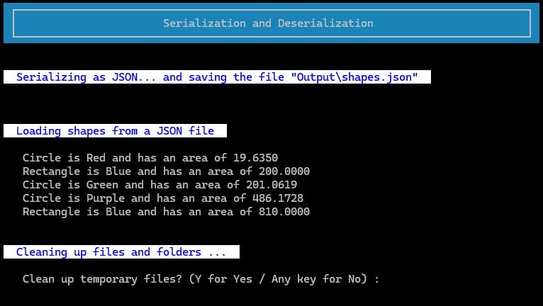
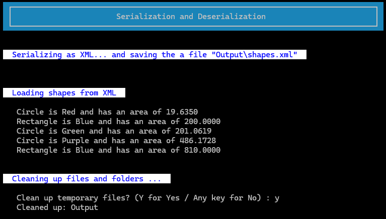

_This README.md file was created with assistance from AI - GitHub Copilot. 
The remaining code was developed without AI support, except where explicitly 
indicated in the code comments._

# Serializing Shapes — Console App

A small console application that demonstrates serializing and deserializing simple shape objects
(and a few console-formatting utilities). The implementation includes shape types (`Circle`, `Rectangle`)
and helpers for formatting console output and basic I/O utilities.

# Files and Folders
```
│   .gitignore
│   Program.cs
│   readme.md
│   SerializingShapes.csproj
│   SerializingShapes.slnx
└───support
│      AnsiColorCodes.cs
│      Circle.cs
│      Formatting.cs
│      Rectangle.cs
│      Shapes.cs
│      Utility.cs
└───screenshots
```

# Files in this repository 


**_Files are located at the project root (no package declared in source files):_**
* **DotNetA1Regex.csproj**
  * Project file for the console application (targets .NET 10).

* **DotNetA1Regex.slnx**
  * Solution file for opening the project in Visual Studio.

* **.gitignore**
  * Repository ignore rules.

* **support/Program.cs** 
  * Console program entry point. Presents options to create, serialize, and deserialize shapes.

* **readme.md**
  * This documentation file.

* **screenshots/**
  * Folder for screen captures and sample runs.

* **support/**
  * Helper and domain source files.

**_Source files (under support/):_**

* **support/AnsiColorCodes.cs**
  * ANSI color constants and small helpers for colored console output.

* **support/Formatting.cs**
  * Console formatting helpers used to render results and menus.

* **support/Utility.cs**
  * Miscellaneous utilities (input parsing/validation, small reusable functions).

* **support/Circle.cs, support/Rectangle.cs, support/Shapes.cs**
  * Shape model classes and related logic.

## Requirements

- .NET SDK: Version 10.0.100
- No external libraries
- ANSI-capable terminal (optional, for colors)

## Usage

This is a console application. Typical usage flows are implemented in `Program.cs` and the helper files under `support/`.
Open `Program.cs` to see how the program:

- Accepts simple input to create shape instances.
- Serializes and deserializes shape objects using built-in .NET serializers.
- Renders results and menus with `Formatting` (and optional ANSI coloring via `AnsiColorCodes`).
- A prompt to clean files created by th program.

## Build and Run (powershell)

> Restore dependencies 
```
dotnet restore
```

> Build
```
dotnet build
```

> Run
```
dotnet run
```

## Usage

Some session screenshots 

```
dotnet run
```


```
dotnet run json
```



## Contact

If you have questions or need further changes, reply here or refer to the course materials.